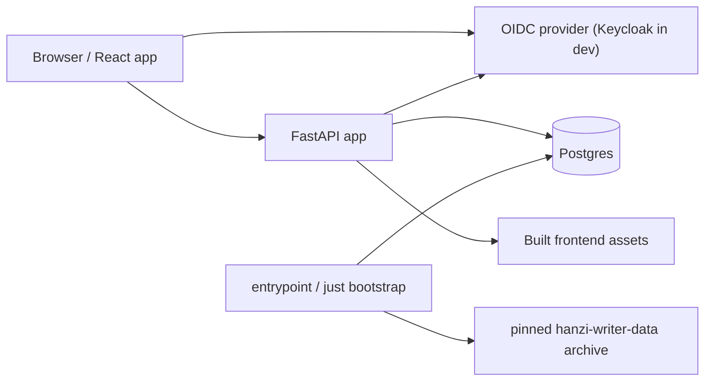

# Architecture

Habagou is a full-stack Hanzi handwriting practice app. The backend is FastAPI
with async SQLAlchemy/Postgres. The frontend is a Vite React app that runs
separately during development and is served as static assets by FastAPI in the
production image.

## Runtime Shape



- Development: Vite serves the frontend and proxies `/api` to the backend.
- Production/Compose: FastAPI serves the built frontend and `/api/v1`.
- Health probes are unversioned: `/healthz` and `/readyz`.
- API resources are versioned under `/api/v1`.
- Authentication uses a configurable OIDC authorization-code flow and a signed
  session cookie. Local development uses Keycloak; deployment can select any
  standards-compliant OIDC provider, including Auth0, without changing the
  current-user resolver.

## Backend Modules

```
src/habagou/
  app.py               # app factory, middleware, exception handlers
  config.py            # environment-driven settings
  db.py                # async engine/session factory
  dependencies.py      # current-user resolver
  auth.py              # authlib provider registration and identity extraction
  events.py            # workflow event logging
  domains/             # pure, I/O-free domain logic
    streaks.py         # pure daily-goal streak and milestone calculations
    scheduling.py      # pure Leitner-ladder scheduler (queue generation, ladder update)
  routers/
    health.py          # healthz/readyz
    v1/                # packs, characters, progress, path, generation
  services/            # business logic (incl. pack_generation agent, rate_limit)
  repositories/        # SQLAlchemy data access (one module per bounded context)
  models/              # SQLAlchemy models (one module per bounded context)
  dtos/                # Pydantic API DTOs
  web/serve.py         # production static frontend serving
```

Routers translate HTTP into DTOs and service calls. Services own application
rules. Repositories isolate SQLAlchemy query details. DTOs are separate from ORM
models.

The Learning Path follows the same layering: `routers/v1/path.py` ->
`services/path.py` -> `repositories/` (`PathRepository`,
`ReviewStateRepository`), with request/response shapes in `dtos/path.py`.
Queue generation and the Leitner-ladder update themselves are pure logic in
`domains/scheduling.py` (mirroring `domains/streaks.py`) — no I/O, so the scheduling
algorithm can be swapped (e.g. for SM-2/FSRS) without touching the service,
router, or API contract. See [docs/api.md](api.md) for the endpoint contract
and [docs/product/prd-path.md](product/prd-path.md) for the feature spec.

Agent pack generation follows the same layering: `routers/v1/generation.py` ->
`services/pack_generation.py` (a pydantic-ai agent, OpenAI-compatible models via
OpenRouter) -> `repositories/` (`CharacterRepository`, `PackRepository`), with
draft shapes in `dtos/generation.py`. The model is grounded so a generated pack
only references hanzi that exist in the stroke corpus, in three layers: a
`find_characters` agent tool (corpus membership + stroke counts, no glosses), an
output validator that retries the model on any non-corpus glyph, and
`PackRepository.create` re-validating every glyph at save. Drafts persist as
private owned packs; the draft endpoint is capped by a per-user in-memory
`services/rate_limit.py` window. See
[ADR 0010](adrs/0010-agent-pack-generation.md).

FastAPI requests, SQLAlchemy queries, and Pydantic AI runs are instrumented with
Logfire. The token is optional (`send_to_logfire="if-token-present"`), and no
system metrics instrumentation is enabled. User prompts and model responses are
included in Pydantic AI spans so generation conversations can be reviewed in
Logfire. The existing optional generic OTLP exporter continues to share the same
OpenTelemetry provider.

## Data Model

- `characters`: pinned Hanzi Writer stroke JSON imported into Postgres.
- `packs`: learning packs with nullable `owner_id` and sort order. `owner_id
  IS NULL` is a global, curated, seed-managed pack visible to everyone;
  non-null is a private pack visible only to its owner (created via
  `PackRepository.create(owner_id=...)`, the write path agent pack generation
  uses). See
  [ADR 0009](adrs/0009-pack-ownership.md) for why ownership replaced the
  earlier lifecycle status and [ADR 0010](adrs/0010-agent-pack-generation.md)
  for the generation flow.
- `pack_characters`: pack-specific pinyin/meaning metadata.
- `pack_sentences`: sentence activity prompts, including sentence-only Hanzi.
- `users`: authenticated learner accounts keyed by provider issuer + subject.
- `activity_completions`: append-only progress events aggregated at read time.
  Carries a `source` discriminator (`'pack'` | `'path'`) and a nullable
  `path_item_id` FK; whole-pack badge aggregation (`per_pack_aggregate`)
  filters to `source='pack'`, while daily-goal/streak counting uses both.
- `path_items`: the materialized, append-only Path queue — one row per
  generated lesson (activity, kind, owning pack, position, pinned `content`
  JSON snapshot). Rows are never mutated or deleted after generation; a
  path item's `done`/`current`/`locked` display state is derived at read time
  from whether a completion event exists for it.
- `review_states`: a **rebuildable projection**, not a source of truth — one
  row per `(user, pack, unit_type, unit_ref, activity)` reviewable unit,
  holding `reps`, `last_seen_at`, `due_at`. It is updated transactionally
  alongside each path-item completion event and can be fully rebuilt by
  replaying `activity_completions`. This is the documented exception to
  ADR-0005 (append-only, aggregate-at-read-time): see
  `docs/adrs/0008-review-state-as-rebuildable-projection.md` for why a
  materialized projection is warranted here despite that default. A unit
  test asserts `replay(events) == table contents`.

The corpus import and seed pipeline validates that every curated pack and
sentence character exists in `characters`. `scripts/check_invariants.py` repeats
the production data checks post-deploy or on cron.

## Frontend

The React app lives in `src/habagou/web/frontend`.

- TanStack Router defines home, progress, pack, trace, match, and sentence routes.
- TanStack Query owns API fetching, cache updates, and retry/refetch paths.
- Hanzi Writer renders trace canvases using API-provided stroke JSON.
- Vitest covers state machines/components; Playwright covers full browser
  workflows and production smoke.

## Development And Deployment

**Do not install Nix just to work on Habagou.** Prefer host tools already on
the machine (`uv`, `just`, Node/pnpm) and Compose (or other existing Postgres /
Keycloak) for backing services. Use devenv only when Nix/devenv is already
present (including cloud-agent / `Dockerfile.dev` environments).

Typical no-Nix loop:

1. `just compose-db-up` (and Compose Keycloak when auth is needed)
2. Set `DATABASE_URL` / OIDC env
3. `just bootstrap`
4. `just dev`

When devenv is already available:

1. `devenv up -d` for the per-checkout Postgres + Keycloak services
2. `devenv shell`
3. Inside that shell, `just bootstrap`
4. Inside that shell, `just dev`

The justfile is the stable interface for native, Compose, CI, staging, and
production validation commands.

Deployment uses Fly.io in production: one production image for the app, Postgres
on Neon (project **`habagou`**, external, SSL). Migrations, corpus import, and seeding run once per
deploy on the Fly release machine (`release_command`); app machines skip
bootstrap. See [docs/deploy.md](deploy.md).

Docker Compose also runs the local **production-image smoke** stack
(`just compose-up` / `just compose-smoke`): the app container bootstraps on
start alongside Compose Postgres and Keycloak.

## Verification

- `just gate`: formatting, linting, typechecking, and unit tests.
- `just test-integration`: real Postgres with per-test databases.
- `just test-e2e`: Playwright browser journeys for WF-02 through WF-08.
- `just smoke BASE_URL=...`: read-only production smoke for health, login, and
  anonymous auth/session behavior.
- `scripts/check_invariants.py --dsn ...`: production data invariant check.

See [docs/verification.md](verification.md) for the workflow catalog and
verification approach.
