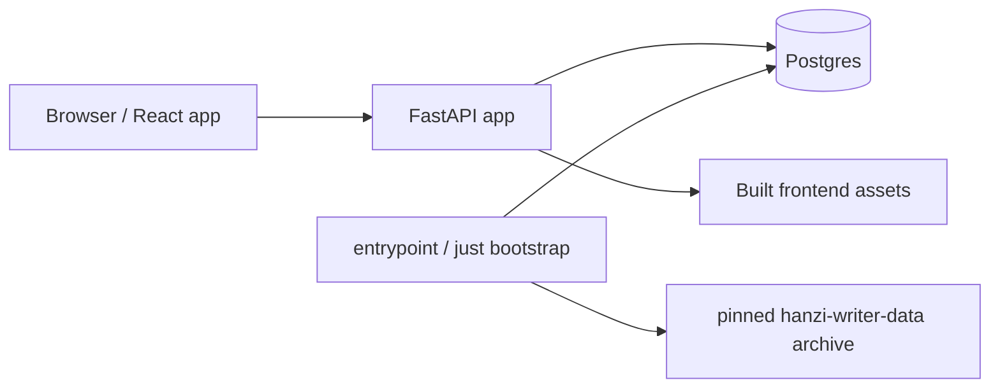

# Architecture

Habagou is a full-stack Hanzi handwriting practice app. The backend is FastAPI
with async SQLAlchemy/Postgres. The frontend is a Vite React app that runs
separately during development and is served as static assets by FastAPI in the
production image.

## Runtime Shape



- Development: Vite serves the frontend and proxies `/api` to the backend.
- Production/Compose: FastAPI serves the built frontend and `/api/v1`.
- Health probes are unversioned: `/healthz` and `/readyz`.
- API resources are versioned under `/api/v1`.

## Backend Modules

```
src/habagou/
  app.py               # app factory, middleware, exception handlers
  config.py            # environment-driven settings
  db.py                # async engine/session factory
  dependencies.py      # current-user resolver
  events.py            # workflow event logging
  streaks.py           # pure daily-goal streak and milestone calculations
  routers/
    health.py          # healthz/readyz
    v1/                # packs, characters, progress, admin
  services/            # business logic
  repositories.py      # SQLAlchemy data access
  models.py            # SQLAlchemy models
  dtos/                # Pydantic API DTOs
  web/serve.py         # production static frontend serving
```

Routers translate HTTP into DTOs and service calls. Services own application
rules. Repositories isolate SQLAlchemy query details. DTOs are separate from ORM
models.

## Data Model

- `characters`: pinned Hanzi Writer stroke JSON imported into Postgres.
- `packs`: curated learning packs with lifecycle status and sort order.
- `pack_characters`: pack-specific pinyin/meaning metadata.
- `pack_sentences`: sentence activity prompts, including sentence-only Hanzi.
- `users`: v1 has one fixed seeded guest user.
- `activity_completions`: append-only progress events aggregated at read time.

The corpus import and seed pipeline validates that every curated pack and
sentence character exists in `characters`. `scripts/check_invariants.py` repeats
the production data checks post-deploy or on cron.

## Frontend

The React app lives in `src/habagou/web/frontend`.

- TanStack Router defines home, progress, pack, trace, match, and sentence routes.
- TanStack Query owns API fetching, cache updates, and retry/refetch paths.
- Hanzi Writer renders trace canvases using API-provided stroke JSON.
- Vitest covers state machines/components; Playwright covers full browser
  workflows and production smoke.

## Development And Deployment

The primary human loop is devenv:

1. `devenv up -d` for the per-checkout Postgres service
2. `devenv shell`
3. Inside that shell, `just bootstrap`
4. Inside that shell, `just dev`

The justfile is the stable interface for native, Compose, CI, staging, and
production validation commands. Agents use `Dockerfile.dev` for a Docker-hosted
devenv shell so Nix is not installed on the host without explicit approval.

Deployment uses Fly.io in production: one production image for the app, Postgres
on Neon (project **`habagou`**, external, SSL). Migrations, corpus import, and seeding run once per
deploy on the Fly release machine (`release_command`); app machines skip
bootstrap. See [docs/deploy.md](deploy.md).

Docker Compose remains the local prod-like stack: the app container bootstraps
on start and serves alongside a Compose Postgres service.

## Verification

- `just gate`: formatting, linting, typechecking, and unit tests.
- `just test-integration`: real Postgres with per-test databases.
- `just test-e2e`: Playwright browser journeys for WF-02 through WF-08.
- `just smoke BASE_URL=...`: read-only production smoke for health, WF-02, and
  WF-06.
- `scripts/check_invariants.py --dsn ...`: production data invariant check.

See [docs/verification.md](verification.md) for the workflow catalog and
verification approach.
